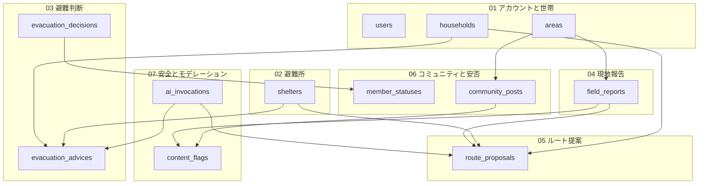
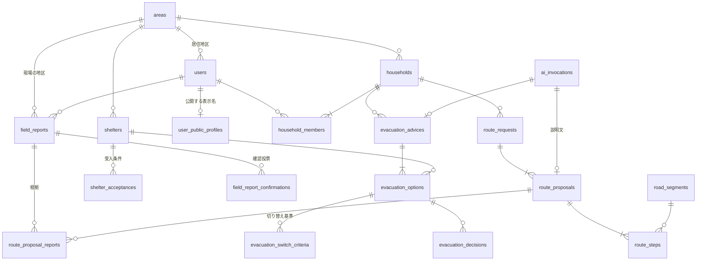

# みちナビ ER図

機能一覧を対象にしたデータベース設計をまとめる。

## ファイル構成

| ファイル | 内容 | 対応機能 |
| --- | --- | --- |
| [er/00-conventions.md](er/00-conventions.md) | 命名、型、DB クライアントの使い分け、メッシュ仕様、ENUM 一覧、削除規則、保持期間、トランザクション境界 | S1、S6 |
| [er/01-account-household.md](er/01-account-household.md) | ユーザ、世帯、家族構成、地区マスタ | A1、S6 |
| [er/02-shelter.md](er/02-shelter.md) | 避難所、対応災害、受入条件 | D1、D2 |
| [er/03-evacuation.md](er/03-evacuation.md) | 災害イベント、AI の選択肢と切り替え基準、避難の記録、事前設定、チェックリスト | B1、B2、B3、B4、A5 |
| [er/04-field-report.md](er/04-field-report.md) | 住民の現地報告、写真、確認投票と信頼度 | C3、C4、E3、S1、S2 |
| [er/05-route.md](er/05-route.md) | 経路探索と AI の責務分担、交通状況 | C3、C1 |
| [er/06-community-status.md](er/06-community-status.md) | 地域コミュニティ、安否ステータス、共有範囲 | E1、E4、E5 |
| [er/07-safety-moderation.md](er/07-safety-moderation.md) | 本人確認、レート制限、通報、AI 呼び出しの記録、RLS の方針 | S3、S4、S5、S6 |
| [er/90-feature-matrix.md](er/90-feature-matrix.md) | 機能IDとテーブルの対応表、全テーブル一覧 | 全体 |

## ドメインの関係

世帯（`households`）がすべての起点になり、住民の投稿（`field_reports`）と避難所（`shelters`）が判断の入力として合流する。
AI を呼ぶ処理は `ai_invocations` に記録を残してから、検証を通った出力だけを正規化されたテーブルに展開する。

## 中心となるテーブル

ドメインをまたぐ主要な関連だけを抜き出すと次のようになる。

カラムを含む図は各ドメインのファイルにある。

## 設計を貫く判断

### 家族構成を世帯という単位に持たせる

家族構成をユーザ個人にぶら下げず、`households` を挟む。
夫婦がそれぞれアカウントを持つときに同じ家族を二重登録させないためと、家族への状況共有（E5）の共有先を「同じ世帯のメンバー」という一つの条件で書けるためである。

ただし世帯の所属を無条件に共有先とはしない。
同居していても居場所を知られたくない相手はいる。
既定の共有範囲を `users.status_share_scope` に、相手ごとの遮断を `status_share_blocks` に持つ（[06](er/06-community-status.md#安否の共有範囲)）。

家族の全員がアカウントを持つとは限らない。
`household_members.user_id` を NULL 可にし、アカウントを持たない家族も 1 人 1 行として登録する。
安否（E4）の主体も `users` ではなく `household_members` にし、スマホを持たない家族の安否を同居の家族が代理で登録できるようにする（[01](er/01-account-household.md#アカウントを持たない家族)）。

### 個人の位置は保存の直前に丸める

住民が投稿する位置と自宅の位置は、250m の地域メッシュのコードに変換してから保存する（S1）。
正確な座標がカラムに残ると、ログ出力、管理画面、権限設定の誤り、バックアップの持ち出しといった複数の経路から取り出せる状態になる。
表示のたびに丸める方式では、これらの経路に対して防御にならない。

一方、経路探索と道路区間への対応づけは数 m の精度を要求するため、リクエストの処理中はメモリ上で正確な座標を使う（[05](er/05-route.md#座標の扱い)）。
精度を落とすのは保存の段階に限る。

避難所と地区の境界は公開情報なので、正確な座標を持つ。

### AI に作らせるものを限る

AI が担うのは、避難の選択肢と切り替え基準の組み立て（B1）と、経路の説明文（C3）である。
経路そのものは探索エンジンが計算し、AI は触らない。
250m メッシュの列だけでは道路の接続、橋、通行方向、歩道を検証できず、存在しない経路が混ざりうるためである（[05](er/05-route.md#経路を誰が作るか)）。

出力は JSONB のまま持たず、選択肢、切り替え基準、手順という単位に正規化する。
切り替え基準を後から評価して画面に出すにはしきい値が数値カラムとして引ける必要があり、どの案を選んだかを記録しないと避難先の分散（B3）が計算できない。

構造化された形式で出させること自体は、プロンプトインジェクションへの対策にはならない。
形式の検証で防げるのは形式の違反だけで、投稿本文に仕込まれた指示に誘導された出力はスキーマを通る。
候補 ID への限定、受入条件の SQL による足切り、出力と候補集合の突き合わせを重ねて防ぐ（[07](er/07-safety-moderation.md#プロンプトインジェクションへの対策)）。

AI が出したしきい値を、自動で通知を送る条件には使わない。

### 認可は RLS を第一の防壁に置く

Supabase の service role キーは RLS を迂回する。
Router がすべての問い合わせで service role を使うと、RLS は 1 行も評価されず、S6 は Router の実装だけに依存することになる。

画面からの読み書きはユーザの JWT を引き継ぐクライアントで行い、service role はマスタ取り込み、AI 出力の保存、通知の作成、モデレーション、日次バッチに限る。
service role を使う処理では、入力された `household_id` を条件に使わず `auth.uid()` から解決する（[00](er/00-conventions.md#db-クライアントの使い分け)）。

### 信頼度は点数ではなく数え上げで持つ

現地報告には、現場の地区（`observed_area_id`）と投稿者の居住地区（`reporter_area_id`）という性格の違う二つの地区が関わる。
住民は自宅の外でも投稿するため、一つにまとめると地図上のピンの場所と地区ラベルが食い違う。

信頼度（E3）が数えるのは、他の住民が押した確認投票である。独立した報告の数ではない。
表示も「〇〇町に住む 4 人が確認」とし、票数を真偽の判定として書かない。
自己投票の禁止、世帯 1 票、電話確認の要求、票の有効期限を重ねても、票だけで誤情報を止められるわけではない（[04](er/04-field-report.md#信頼度の計算と限界)）。

## P1 の範囲

機能一覧の P1 をそのまま作ると 32 テーブルになり、PostGIS、RLS、Storage の画像処理、モデレーション、電話確認、レート制限、AI の構造化出力、避難所データの取り込み、経路探索が 2 週間に収まらない。

そこで P1 を二段に分ける。

### 最小構成（24 テーブル）

| ドメイン | テーブル |
| --- | --- |
| 01 | `areas` / `users` / `user_public_profiles` / `households` / `household_members` / `care_needs` / `household_member_care_needs` / `pets` |
| 02 | `shelters` / `shelter_hazard_supports` / `acceptance_conditions` / `shelter_acceptances` |
| 03 | `evacuation_advices` / `evacuation_options` / `evacuation_switch_criteria` |
| 04 | `field_reports` / `field_report_photos` / `field_report_confirmations` |
| 07 | `content_flags` / `moderation_actions` / `rate_limits` / `rate_limit_counters` / `user_verifications` / `ai_invocations` |

この範囲で A1、B1、B4、C4、D1、D2、E3、S1 から S6 が成立する。
C3 は「現地報告を地図に重ね、危険区間を色分けする」ところまでになる。

`disaster_events` は表を作らず、単一の災害を前提にする。
`field_reports.disaster_event_id` と `evacuation_advices.disaster_event_id` は NULL 可のまま置き、複数イベントの切り替えは後から足す。

### P1 の後半に回すもの

| テーブル | 落とした場合の影響 |
| --- | --- |
| `disaster_events` / `hazard_alerts` | 警戒レベルを手動入力かモックにする。B1 の入力の質が落ちる |
| `evacuation_decisions` | ユーザが選んだ案を残せない。B3 の前提が作れない |
| `household_invitations` | 世帯を一人で登録する形になる。E5 が試せない |
| `ai_output_violations` / `audit_logs` | 検証の失敗をアプリログに出すだけになる |
| `road_segments` | 通行可否がメッシュ単位の表示にとどまる |

### P2 に送るもの

経路探索そのもの（`route_requests` 以下）、コミュニティ（`community_posts` 以下）、安否（`member_statuses` 以下）、事前設定（`evacuation_plans`）、チェックリスト、交通状況。

## 実装の着手順

| 段階 | 作るもの | 依存 |
| --- | --- | --- |
| 1 | `areas`、`care_needs`、`acceptance_conditions`、`rate_limits` のマスタ投入 | なし |
| 2 | `users`、`user_public_profiles`、`households`、`household_members`、`pets`（A1） | 段階 1 |
| 3 | `shelters` 系のデータ取り込み（D1、D2） | 段階 1 |
| 4 | `user_verifications`、`rate_limit_counters`（S3） | 段階 2 |
| 5 | `field_reports` と写真、確認投票（C4、E3、S1、S2） | 段階 2、4 |
| 6 | `ai_invocations` と `evacuation_advices` 系（B1、B4、S5） | 段階 2、3 |
| 7 | `content_flags`、`moderation_actions`（S4） | 段階 5 |
| 8 | P1 の後半、続いて P2 | 段階 7 まで |

RLS のポリシーは各段階のマイグレーションに含める（S6）。
テーブルを作ってから後でまとめてポリシーを足す進め方にすると、有効化の漏れに気付けない。

## 未決の項目

- 地区（`areas`）の粒度を町字にするか丁目にするか。E3 の「同じ地区の何人」という表示が成り立つ人数が集まるかで決まるため、対象地域を絞ってから判断する。
- 経路探索エンジンをどれにするか。自前で OSRM を立てるか外部 API を使うかで、運用の手間と `route_proposals.engine` に入る値が変わる。
- 道路区間（`road_segments`）の外部データを取り込めるか。取り込めない場合、通行可否はメッシュ単位の表示にとどまる。
- 交通状況（C1）の供給元。調達できなければ `traffic_snapshots` は作らず、経路の重みは現地報告だけから決める。
- 電話確認（S3）の SMS 費用と、確認を必須にした場合の登録の落ち込み。必須にしないなら、確認済みのみ投票可という E3 の条件も見直しが要る。

## 次の作業

この設計は概念の整理までを扱っている。
実装に入る前に、次を SQL に落として再度レビューする。

- CHECK、UNIQUE、外部キーの削除規則、NULL 可否を含む `create table` 文
- RLS のポリシーと `security definer` 関数の実装
- レート制限と投稿を 1 トランザクションで行う DB 関数
- 保持期間のバッチ（`pg_cron`）
- 認可のテスト（[07](er/07-safety-moderation.md#認可のテスト)）

削除規則、保持期間、トランザクション境界の方針は [00](er/00-conventions.md) に一覧としてまとめてある。
