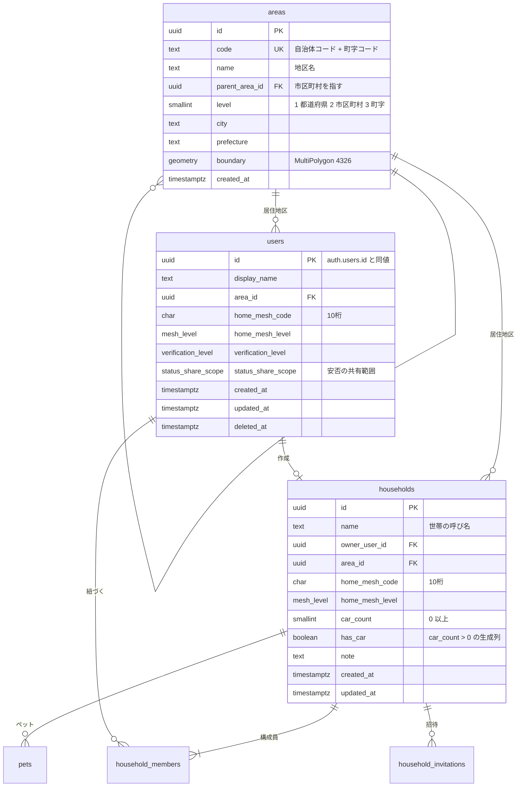
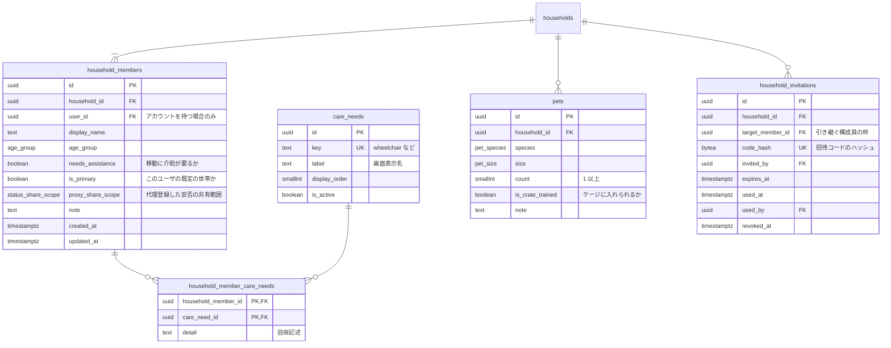

# アカウントと世帯

| 対応機能 | 内容 |
| --- | --- |
| A1 | 家族構成の登録・更新（人数、年齢層、要配慮者、ペット、車の有無、住所） |
| E3 | 地区ラベルの供給元となる `areas` |
| S1 | 自宅位置のメッシュ丸め |
| S6 | 他人の家族情報を取れないようにする認可の起点 |

ここに登録された世帯の姿が、避難の選択肢の生成（B1）と避難所の受入条件との突き合わせ（D2）の入力になる。
着手も最初になる。

## 設計の骨格

家族構成をユーザ個人にぶら下げず、**世帯**（`households`）という単位を挟む。
夫婦がそれぞれアカウントを持つ場合に家族構成を二重に登録させないためと、家族への状況共有（E5）の共有先を「同じ世帯のメンバー」という一つの条件で書けるためである。

ただし世帯を共有先の既定にすることには例外がある。
同居していても安否を知らせたくない相手はいるし、別居した後も世帯から抜けきれていない場合がある。
共有の可否は世帯の所属とは別に `users.status_share_scope` と `status_share_blocks` で持ち、既定を共有にしつつ相手ごとに切れるようにする（[06](06-community-status.md#安否の共有範囲)）。

住所は文字列として保存しない。
入力された住所はジオコーディングして**地区**（`areas`）と 250m メッシュに変換し、その二つだけを残す。
番地まで残すと、投稿位置を丸めた意味（S1）が失われる。

## ER図



構成員とペット、招待は世帯にぶら下がる。



## テーブル定義

### areas（地区）

地区ラベルと信頼度表示（E3）が成り立つかどうかは、この地区の粒度で決まる。
市区町村では広すぎて「同じ地区の人」という感覚に合わず、丁目まで割ると報告者が集まらない。
町字（大字）を既定の粒度とし、`parent_area_id` で市区町村を親に持つ木構造にする。

| カラム | 型 | 制約 | 説明 |
| --- | --- | --- | --- |
| `id` | `uuid` | PK | |
| `code` | `text` | UNIQUE, NOT NULL | 全国地方公共団体コード + 町字 ID |
| `name` | `text` | NOT NULL | 「〇〇町」など |
| `parent_area_id` | `uuid` | FK → `areas.id` | 最上位は NULL |
| `level` | `smallint` | NOT NULL, CHECK 1..3 | 1 = 都道府県、2 = 市区町村、3 = 町字 |
| `city` / `prefecture` | `text` | NOT NULL | 表示用に非正規化して持つ |
| `boundary` | `geometry(MultiPolygon,4326)` | | 住所と投稿位置からの地区判定に使う |
| `centroid` | `geography(Point,4326)` | | 地図の初期表示位置 |

`city` と `prefecture` を親から辿らず重複して持つのは、投稿一覧で毎回 3 段の再帰結合を避けるためである。
地区の統廃合は年に数件しかなく、更新の食い違いは実害にならない。

### users（ユーザ）

`auth.users` の行と 1 対 1 で対応させ、`id` に同じ UUID を入れる。
Supabase の認証テーブルにアプリ固有のカラムを足せないため、公開スキーマ側に影を作る形になる。

| カラム | 型 | 制約 | 説明 |
| --- | --- | --- | --- |
| `id` | `uuid` | PK, FK → `auth.users.id` ON DELETE CASCADE | |
| `display_name` | `text` | NOT NULL | 実名を求めない |
| `area_id` | `uuid` | FK → `areas.id` | 投稿の `reporter_area_id` と投票の `voter_area_id` の元（E3） |
| `home_mesh_code` | `char(10)` | | 自宅の 250m メッシュ |
| `home_mesh_level` | `mesh_level` | NOT NULL DEFAULT `mesh_250m` | |
| `verification_level` | `verification_level` | NOT NULL DEFAULT `anonymous` | 投稿レート制限の段階（S3） |
| `status_share_scope` | `status_share_scope` | NOT NULL DEFAULT `household` | 安否の既定の共有範囲（E5） |
| `deleted_at` | `timestamptz` | | 退会後も投稿の表示を保つため論理削除 |

このテーブルは本人しか SELECT できない。
投稿一覧に出す表示名は `user_public_profiles` から引く（[07](07-safety-moderation.md#user_public_profiles)）。
RLS は行を絞る仕組みで列は隠せないため、`users` を第三者に読ませると `area_id` と `home_mesh_code` まで一緒に読める。

### households（世帯）

| カラム | 型 | 制約 | 説明 |
| --- | --- | --- | --- |
| `id` | `uuid` | PK | |
| `name` | `text` | NOT NULL | 「山田家」など。既定値は作成者の表示名 |
| `owner_user_id` | `uuid` | FK → `users.id`, NOT NULL | 世帯の管理者。招待と削除ができる |
| `area_id` | `uuid` | FK → `areas.id`, NOT NULL | 避難所の候補を絞る単位 |
| `home_mesh_code` | `char(10)` | NOT NULL | 避難ルートの出発点（A5、C3） |
| `car_count` | `smallint` | NOT NULL DEFAULT 0, CHECK `>= 0` | 車の台数 |
| `has_car` | `boolean` | 生成列 | `car_count > 0` |

車の有無を独立したカラムにせず生成列にする。

```sql
alter table public.households
  add column has_car boolean
  generated always as (car_count > 0) stored;
```

`has_car` と `car_count` を両方とも入力可能にすると、「車あり・0 台」という状態が作れてしまう。
移動手段の切り分け（B4）はこの値を見るため、食い違いがそのまま提案の誤りになる。

### household_members（世帯構成員）

アカウントを持たない家族（乳幼児、高齢の親）も 1 行として登録できるよう、`user_id` を NULL 可にする。
人数と年齢層の内訳がここに揃うことで、避難所の受入条件（D2）との突き合わせができる。

| カラム | 型 | 制約 | 説明 |
| --- | --- | --- | --- |
| `household_id` | `uuid` | FK ON DELETE CASCADE, NOT NULL | |
| `user_id` | `uuid` | FK → `users.id` ON DELETE SET NULL | アカウントを持つ場合のみ |
| `display_name` | `text` | NOT NULL | 「母」「長男」など |
| `age_group` | `age_group` | NOT NULL | |
| `needs_assistance` | `boolean` | NOT NULL DEFAULT false | 徒歩避難の可否判定に効く |
| `is_primary` | `boolean` | NOT NULL DEFAULT false | このユーザの既定の世帯か。`user_id` が NULL なら常に false |
| `proxy_share_scope` | `status_share_scope` | `user_id` が NULL の行のみ設定可、既定 `household` | 代理登録した安否を別世帯の家族にも見せるか（E5） |

生年月日ではなく年齢層だけを持つのは、避難の判断に必要な粒度がそこまでで、誕生日は個人を特定しうる情報だからである。

### 世帯まわりの制約

一人のユーザが実家と自宅の二つの世帯に属することはある。
そのうえで次を保証する。

```sql
-- 同じ世帯に同じユーザが二重に入らない。
-- user_id が NULL の行は互いに重複と見なされないため、
-- アカウントを持たない構成員は同じ世帯に何行あってもよい
alter table public.household_members
  add constraint household_members_user_uniq unique (household_id, user_id);

-- 既定の世帯はユーザごとに 1 つまで
create unique index household_members_primary_uniq
  on public.household_members (user_id)
  where is_primary and user_id is not null;

-- 既定の世帯という概念はアカウントを持つ人にしか無い
alter table public.household_members
  add constraint household_members_primary_requires_user
  check (not is_primary or user_id is not null);

-- 代理登録の共有範囲は、アカウントを持たない構成員にだけ意味がある
alter table public.household_members
  add constraint household_members_proxy_scope_requires_no_user
  check (user_id is null or proxy_share_scope is null);
```

一つ目を部分インデックス（`where user_id is not null`）にしない。
PostgreSQL の外部キーは参照先に完全な一意制約を要求し、部分インデックスを参照先にできないためである。
`(household_id, user_id)` は次の複合外部キーの参照先になるので、部分インデックスでは `there is no unique constraint matching given keys` で失敗する。

`owner_user_id` がその世帯の構成員であることは、外部キーだけでは表せない。
上の一意制約があるので、`households` 側から複合外部キーで参照できる。

```sql
alter table public.households
  add constraint households_owner_is_member
  foreign key (id, owner_user_id)
  references public.household_members (household_id, user_id)
  deferrable initially deferred;
```

遅延可能にするのは、世帯の作成時に `households` と最初の `household_members` を同じトランザクションで INSERT するためである。
どちらを先に入れても、コミット時点で成立していればよい。

`owner_user_id` は NOT NULL なので、この外部キーは `user_id` が NULL でない行にしか一致しない。
アカウントを持たない構成員が世帯の管理者になることはない。

構成員の脱退は次のように扱う。

| 状況 | 扱い |
| --- | --- |
| 管理者以外が抜ける | `household_members` の行を削除する |
| 管理者が抜ける | 残る構成員のうちアカウントを持つ最も古い行に `owner_user_id` を移す |
| アカウントを持つ構成員が管理者だけになり、その人が抜ける | 世帯を削除する |
| 最後の一人が抜ける | 世帯を削除する。`household_members`、`pets`、`household_invitations` は CASCADE で消える |

世帯を削除しても `evacuation_decisions` と `field_reports` は残る。
どちらも `household_id` ではなく `user_id` を主たる持ち主として持つためである。
`evacuation_decisions.household_id` は ON DELETE SET NULL にする。

### アカウントを持たない家族

家族がいてもアプリを使うのが一人だけ、という場合が想定される中心になる。
その人が世帯の全員を登録し、他の家族はアカウントを作らない。

この形は `household_members.user_id` を NULL 可にすることで表す。
アカウントの有無にかかわらず 1 人 1 行になり、人数、年齢層、要配慮、介助の要否はどの行にも揃う。
避難所の受入条件との突き合わせ（D2）も、避難の選択肢の生成（B1）も、`user_id` を見ずに `household_members` の全行を数えるだけでよい。

| 項目 | アカウントを持つ構成員 | 持たない構成員 |
| --- | --- | --- |
| `user_id` | 埋まる | NULL |
| `display_name` | 本人が決める | 登録者が付ける続柄（「母」「長男」） |
| `age_group` / `needs_assistance` / 要配慮 | 登録できる | 登録できる |
| 世帯の管理者になれるか | なれる | なれない |
| 投稿、確認投票、通報 | できる | できない |
| 安否の登録（E4） | 本人が更新する | 同じ世帯の誰かが代理で登録する |
| 安否の共有範囲 | 本人の `users.status_share_scope` | 世帯が決める `proxy_share_scope`。既定は世帯の内側 |

安否（E4）の主体を `users` ではなく `household_members` にしてあるのは、この構成員を安否の対象に含めるためである（[06](06-community-status.md#安否の主体)）。
スマホを持たない高齢の親や子どもこそ、災害時に安否を知りたい相手になる。

氏名を求めず続柄で登録するのは、この行が本人以外の手で作られるためである。
同居家族の持病や障害を、その人の同意を取らないまま登録することになる。
`household_member_care_needs.detail` の自由記述を任意にし、AI に渡す入力から除くのは（[07](07-safety-moderation.md#ai-ログに何を残すか)）、この前提による。
登録画面には、家族の情報を登録することと、それが誰に見えるかを明示する。

#### 一人で使い始めるとき

サインアップの時点で、本人 1 人の世帯を自動で作る。
`households` を 1 行、`household_members` を 1 行（`user_id = auth.uid()`、`is_primary = true`）、同じトランザクションで INSERT する。
家族の追加は任意の操作にする。

「世帯」という語を画面に出す必要はない。
利用者から見えるのは「自分と家族の登録」であり、`households` は複数のアカウントが同じ家族構成を共有するための内部の受け皿になる。

#### 後からアカウントを持ったとき

登録済みの構成員が自分でアカウントを作る場合、既存の行に `user_id` を紐づける。新しい行を作らない。
新規に行を足すと、同じ人が 2 行になり、世帯の人数が実際より多く数えられる。
収容人数との突き合わせ（B3）と、要配慮の重複がそのままずれる。

引き継ぐ枠は招待の時点で指定する。
`household_invitations.target_member_id` に、どの構成員の枠を渡す招待かを持たせる。

| `target_member_id` | 招待を受けたときの動き |
| --- | --- |
| 指定あり | その行の `user_id` を受諾者で埋める。すでに埋まっていれば失敗させる |
| NULL | 新しい `household_members` の行を作る |

管理者が「長男を招待」と選んで発行したコードは、受諾した時点で長男の行に紐づく。
受諾者が別人だった場合を防ぐ手立ては無いので、コードの受け渡しは家族の間で行われる前提に立つ。

#### 同じ家族が二つの世帯に分かれる場合

夫が妻をアカウント無しで登録し、妻が別に自分の世帯を作った場合、同じ家族が 2 つの世帯として登録される。
これを検出する手立ては持たない。住所も氏名も保存していないため、突き合わせる材料が無い。

招待の導線を「家族を追加する」画面の既定にし、アカウントを持つ相手は招待で加える形に寄せる。
それでも分かれた場合は、両方の世帯がそれぞれ避難所の候補を計算する。人数の二重計上は B3 の混雑度に効くが、2 週間の範囲では割り切る。

### care_needs / household_member_care_needs（要配慮）

要配慮の種類は運営が画面から増やしたいので、ENUM ではなくマスタテーブルにする。
初期値は次のとおり。

| `key` | 表示名 |
| --- | --- |
| `wheelchair` | 車いす |
| `walking_difficulty` | 歩行が困難 |
| `visual_impairment` | 視覚の障害 |
| `hearing_impairment` | 聴覚の障害 |
| `medical_device` | 医療機器や電源が必要 |
| `chronic_illness` | 持病や常備薬がある |
| `pregnant` | 妊娠中 |
| `infant_care` | 授乳やおむつが必要 |
| `dementia` | 認知症 |
| `language_support` | 日本語での案内が難しい |

中間テーブルは `(household_member_id, care_need_id)` の複合主キーにする。
同じ人に同じ配慮を二重登録させないためで、`detail` に自由記述（薬の名前など）を添える。

`detail` は要配慮に関する自由記述であり、機微性が高い。
AI に渡す入力には含めない（[07](07-safety-moderation.md#ai-ログに何を残すか)）。

### pets

ペット可否（D2）との突き合わせに使う。
`count` は `CHECK (count > 0)` にする。0 匹の行を作る意味が無く、削除と区別がつかなくなるためである。

`is_crate_trained` を持つのは、避難所の受入条件がほぼ「ケージに入れられること」を前提にしているためで、種別と大きさだけでは可否を出せない。

### household_invitations

世帯に家族を招く導線。
招待コードは平文で保存しない。
DB のバックアップが流出した場合、未使用の招待がそのまま他人の世帯への入り口になるためである。

| カラム | 型 | 制約 | 説明 |
| --- | --- | --- | --- |
| `target_member_id` | `uuid` | FK → `household_members.id` ON DELETE CASCADE | 引き継ぐ構成員の枠。NULL なら新しい行を作る |
| `code_hash` | `bytea` | UNIQUE, NOT NULL | コードの SHA-256 |
| `expires_at` | `timestamptz` | NOT NULL | 既定は 7 日 |
| `used_at` / `used_by` | `timestamptz` / `uuid` | | 使用済みでも行は消さない |
| `revoked_at` | `timestamptz` | | 管理者が取り消したとき |

コードは 128 ビット以上のランダム値を Base32 で表し、生成した直後に一度だけ画面に出す。
以後は再表示できない。
照合は入力値をハッシュして `code_hash` と突き合わせる形になる。
招待は使い捨てなので、レインボーテーブルへの耐性を持つ遅いハッシュは要らない。

有効な招待は `used_at is null and revoked_at is null and expires_at > now()` で絞る。

## 認可

このドメインは S6（他人のデータを見せない）が最も出やすい場所になる。
RLS では次の関数を土台にする。

```sql
create function public.is_household_member(target uuid)
returns boolean
language sql
security definer
stable
set search_path = public
as $$
  select exists (
    select 1
    from public.household_members m
    where m.household_id = target
      and m.user_id = auth.uid()
  );
$$;
```

`households`、`household_members`、`pets`、`household_member_care_needs` の SELECT と UPDATE のポリシーはすべてこの関数を通す。
`households` の DELETE と `household_invitations` の INSERT は `owner_user_id = auth.uid()` に限る。

`security definer` の関数には `set search_path` を必ず付ける。
付けないと、呼び出し側が `search_path` を差し替えて別のスキーマの `household_members` を参照させられる。

`areas` と `care_needs` はマスタなので全ユーザに SELECT を許し、書き込みは service role だけにする。

世帯を作る処理と招待を受ける処理は、`auth.uid()` から対象を解決する DB 関数にまとめる。
service role クライアントからこれらのテーブルを直接書かない（[00](00-conventions.md#db-クライアントの使い分け)）。

## インデックス

| テーブル | インデックス | 用途 |
| --- | --- | --- |
| `areas` | `(parent_area_id)` / GiST `(boundary)` | 木の展開、住所と投稿位置からの地区判定 |
| `users` | `(area_id)` | 地区ごとの利用者数の把握 |
| `households` | `(owner_user_id)` / `(area_id)` | 自分の世帯の取得、地区単位の集計 |
| `household_members` | `(household_id)` / `(user_id)` | 世帯の展開、所属世帯の逆引き |
| `household_members` | UNIQUE `(household_id, user_id)` | 二重所属の防止、`households` からの複合 FK の参照先 |
| `household_members` | 部分 UNIQUE `(user_id) where is_primary` | 既定の世帯を 1 つに限る |
| `household_invitations` | UNIQUE `(code_hash)` | 招待コードの照合 |
