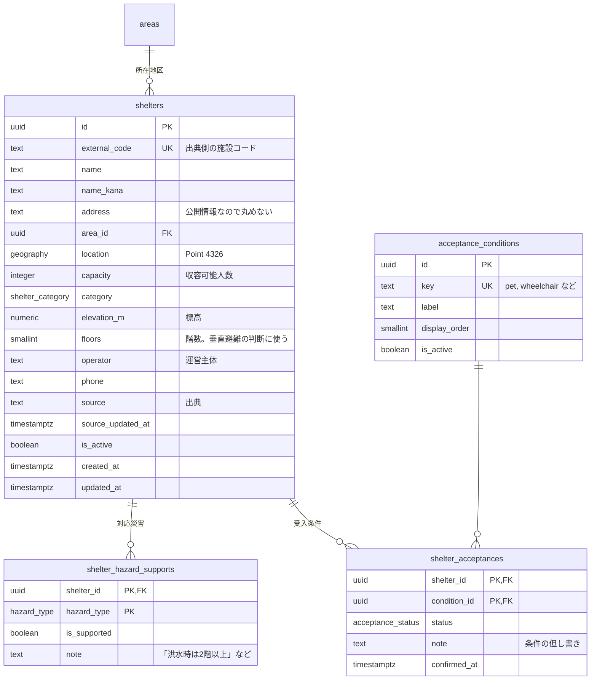

# 避難所

| 対応機能 | 内容 |
| --- | --- |
| D1 | 避難所の場所・規模（指定緊急避難場所の一覧と地図表示） |
| D2 | 受入条件の表示（ペット可否、身体障害、乳幼児など） |
| B1 / B3 | 避難の選択肢と分散の候補地 |

出典は国土地理院の指定緊急避難場所データと各自治体の公開データで、住民は書き換えない。
このドメインだけは投入時にすべて確定する静的データであり、他のドメインより先に用意できる。

## 設計の骨格

災害の種類ごとの対応可否と、受入条件を、どちらも避難所本体のカラムに持たせない。
洪水には使えるが土砂災害には使えない避難所があり、受入条件は運営が後から増やしたいためである。
前者は `shelter_hazard_supports`、後者は `acceptance_conditions` と `shelter_acceptances` に分ける。

受入条件を真偽値にせず 4 値（`available` / `limited` / `unavailable` / `unknown`）にするのは、自治体の公開データに「ペット可（ケージ持参）」のような条件付きが多く、可否の 2 値では現実を写せないためである。
`unknown` を既定値に置き、確認できていないことを画面でそのまま「不明」と出す。

## ER図



## テーブル定義

### shelters（避難所）

| カラム | 型 | 制約 | 説明 |
| --- | --- | --- | --- |
| `id` | `uuid` | PK | |
| `external_code` | `text` | UNIQUE | 出典データの施設コード。再取り込み時の突合キー |
| `name` / `name_kana` | `text` | NOT NULL / NULL 可 | 検索用に読みも持つ |
| `address` | `text` | NOT NULL | |
| `area_id` | `uuid` | FK → `areas.id`, NOT NULL | 地区で候補を絞る |
| `location` | `geography(Point,4326)` | NOT NULL | 最寄り検索に使う。GiST インデックス |
| `capacity` | `integer` | | 収容可能人数。不明なら NULL |
| `category` | `shelter_category` | NOT NULL | 指定緊急避難場所か指定避難所かなど |
| `elevation_m` | `numeric(6,1)` | | 浸水想定との比較に使う |
| `floors` | `smallint` | | 垂直避難の可否（B1 の `vertical`）の材料 |
| `source` / `source_updated_at` | `text` / `timestamptz` | | 出典と、その版の日付 |
| `is_active` | `boolean` | NOT NULL DEFAULT true | 廃止された施設は行を残して false にする |

`capacity` が NULL のまま残る施設は多い。
避難先の分散（B3）で混雑率を出すときは、NULL を「上限不明」として扱い、率ではなく人数だけを表示する。
0 で埋めると混雑率が無限大になり、その避難所が候補から永久に外れる。

### shelter_hazard_supports（対応災害）

`(shelter_id, hazard_type)` の複合主キーで、避難所ごとに災害種別の行を持つ。
`is_supported` を持つのは、「対応していないことが明記されている」と「データに記載がない」を区別するためである。
行が無い場合は不明として扱う。

### acceptance_conditions / shelter_acceptances（受入条件）

条件のマスタは運営が増やせるようテーブルにする。初期値は次のとおり。

| `key` | 表示名 | 参照元 |
| --- | --- | --- |
| `pet` | ペット同行 | `pets` |
| `wheelchair` | 車いすで入れる | `care_needs.wheelchair` |
| `barrier_free_toilet` | 多目的トイレ | `care_needs.walking_difficulty` |
| `infant` | 乳幼児の受入 | `age_group.infant` |
| `nursing_room` | 授乳スペース | `care_needs.infant_care` |
| `medical_care` | 医療的ケアに対応 | `care_needs.medical_device` |
| `power_supply` | 電源が使える | `care_needs.medical_device` |
| `allergy_food` | アレルギー対応食 | 自由記述 |
| `welfare` | 福祉避難所として受入 | `needs_assistance` |

「参照元」の列は、世帯の登録内容（A1）のどの項目と突き合わせるかを示す。
この対応関係があることで、世帯の要配慮項目に `unavailable` が付いた避難所を SQL で候補から落とせる。
B1 の足切りを AI の判断に依らせないための土台になる（[07](07-safety-moderation.md#プロンプトインジェクションへの対策)）。

`confirmed_at` は自治体データで裏が取れた日付を入れる。
古い確認日のまま残っている条件は、画面で「最終確認日」を添えて出す。

## 世帯と避難所の突き合わせ

受入条件の判定は SQL で完結させる。
世帯が必要とする条件を満たさない避難所を落とすビューを用意し、B1 と B3 の両方から使う。

```sql
create view public.v_shelter_match as
select
  h.id                as household_id,
  s.id                as shelter_id,
  bool_and(
    coalesce(sa.status, 'unknown') <> 'unavailable'
  )                   as is_acceptable,
  count(*) filter (
    where coalesce(sa.status, 'unknown') = 'unknown'
  )                   as unknown_condition_count
from public.households h
join public.shelters s
  on s.area_id = h.area_id and s.is_active
join public.v_household_required_conditions rc
  on rc.household_id = h.id
left join public.shelter_acceptances sa
  on sa.shelter_id = s.id and sa.condition_id = rc.condition_id
group by h.id, s.id;
```

`v_household_required_conditions` は、世帯の構成員が持つ `care_needs`、ペットの有無、乳幼児の有無から、必要な `acceptance_conditions` の行を導くビューである。
上の表の「参照元」列がそのまま対応規則になる。

`unknown` を除外せず件数として返すのは、不明な条件が多い避難所を候補から外すのではなく、「確認が取れていない項目がある」と添えて出すためである。
災害時に候補が一つも残らない状態を作るほうが危険である。

## インデックス

| テーブル | インデックス | 用途 |
| --- | --- | --- |
| `shelters` | GiST `(location)` | 最寄り避難所の検索 |
| `shelters` | `(area_id, is_active)` | 地区の一覧表示 |
| `shelters` | UNIQUE `(external_code)` | 出典データの再取り込み |
| `shelter_acceptances` | `(condition_id)` | 「ペット可の避難所」の逆引き |

## 取り込み運用

出典データは `supabase/seed/` に CSV で置き、`external_code` を突合キーに UPSERT する。
再取り込みで行を消して入れ直さないのは、`evacuation_decisions` や `route_proposals` から `shelter_id` を参照しているためで、削除すると過去の避難記録が壊れる。
廃止された施設は `is_active = false` にする。
