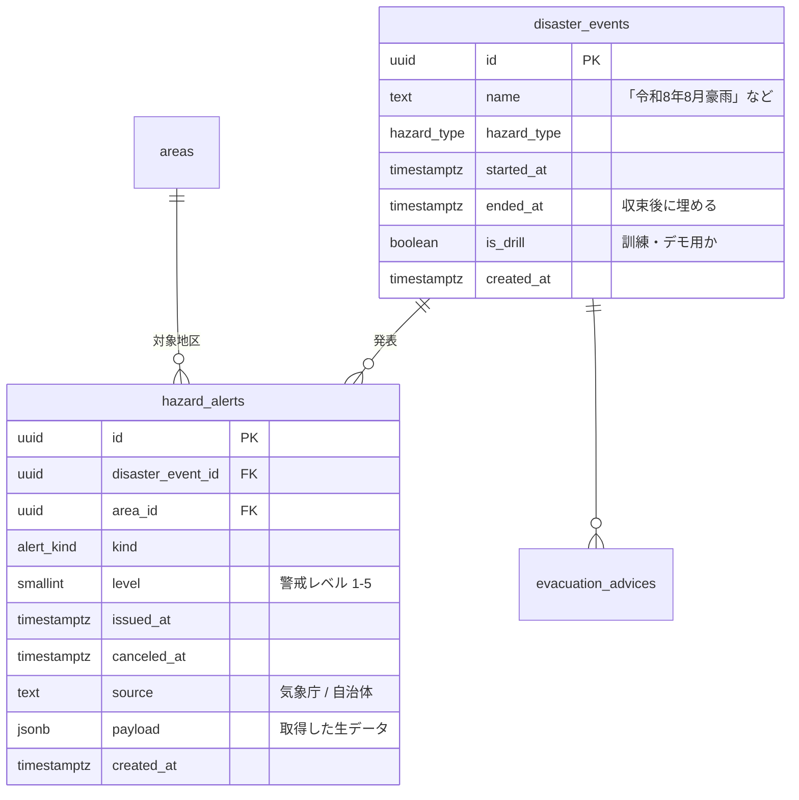
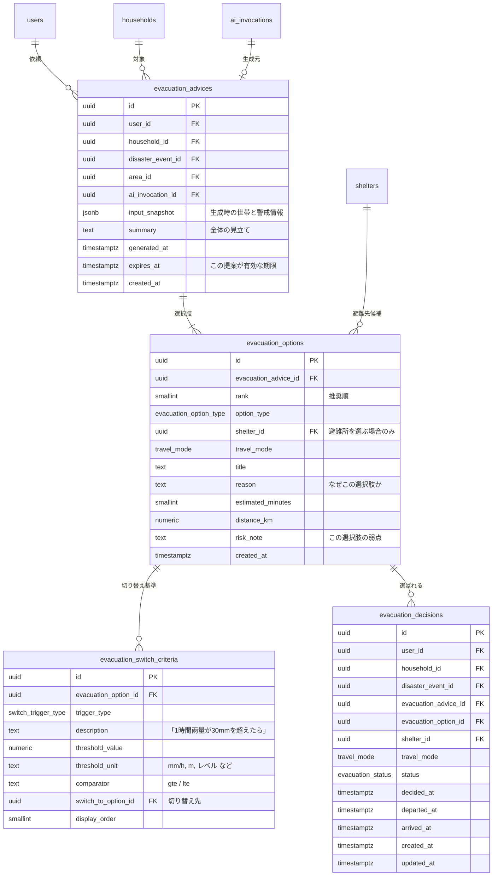
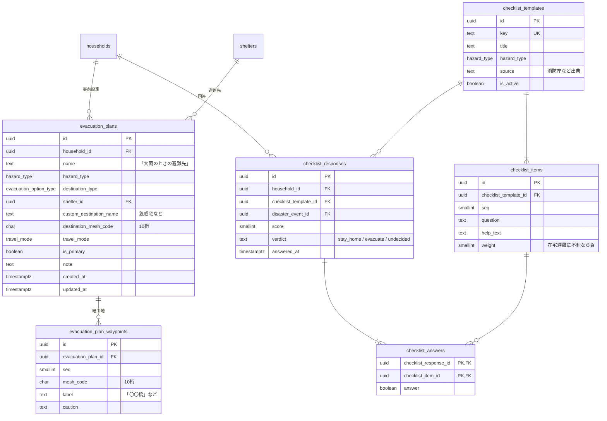

# 避難判断

| 対応機能 | 内容 | 優先度 |
| --- | --- | --- |
| B1 | 条件分岐した選択肢と切り替え基準の提示 | P1 |
| B4 | 徒歩／車の切り分け | P1 |
| B2 | 在宅避難か避難所かの判断補助（チェックリスト） | P2 |
| B3 | 避難先の分散 | P2 |
| A5 | 避難ルートの事前設定 | P2 |

みちナビが AI を使う理由の中心はここにある。
出力は「避難してください」という指示ではなく、複数の選択肢と、**どうなったら切り替えるか**という基準の組である。
その形をそのままテーブルに写す。

## 設計の骨格

AI の出力を一つの JSON カラムに投げ込まず、選択肢（`evacuation_options`）と切り替え基準（`evacuation_switch_criteria`）に正規化する。

- 切り替え基準は後から評価して画面に出す。「1時間雨量が 30mm を超えたら」という条件を実際の観測値と突き合わせるには、しきい値が数値カラムとして引ける必要がある。
- ユーザがどの選択肢を選んだか（`evacuation_decisions`）を記録しないと、避難先の分散（B3）が計算できない。選択肢に安定した ID が要る。
- 出力を正規化しておくと、避難所 ID が候補集合に含まれるか、移動手段が世帯の車の有無と矛盾しないかを、保存の前に SQL で検査できる。

三点目は S5 に関わるが、構造化された形式で出させること自体が対策になるわけではない。
形式の検証で防げるのは形式の違反だけで、投稿本文に仕込まれた指示に誘導された「形式は正しいが内容が危険な出力」はそのまま通る。
必要なのは、AI に渡す候補を限ること、受入条件の足切りを SQL で行うこと、出力を候補集合と突き合わせて再検査することの組み合わせになる。
対策の全体は [07](07-safety-moderation.md#プロンプトインジェクションへの対策) にまとめた。

災害イベント（`disaster_events`）を明示的に持つのは、平時の登録内容と災害時の判断を切り離すためと、デモや訓練で過去のイベントを再現できるようにするためである。

## ER図：災害イベントと警戒情報



`payload` に生データを残すのは、外部 API の項目を全部カラムに写すと供給元の変更に追随できなくなるためである。
判断に使う項目（`kind`、`level`、`issued_at`）だけをカラムに引き上げ、残りは JSONB に置く。

## ER図：AI の提案と選択



## ER図：平時の備え



## テーブル定義

### evacuation_advices（AI の提案セッション）

一回の提案が 1 行になる。
`input_snapshot` に、そのとき AI に渡した世帯構成、地区、警戒レベル、周辺の投稿の要約を JSONB で固めて残す。
世帯構成は後から変わるため、外部キーを辿るだけでは「なぜその提案になったか」を再現できない。

`expires_at` を持つのは、避難の提案が数時間で陳腐化するためである。
期限を過ぎた提案は画面で「情報が古い」と示し、再生成を促す。

### evacuation_options（選択肢）

一つの提案に複数行がぶら下がる。`rank` は推奨順で、1 が最も勧める案になる。
`option_type` が `stay_home` や `vertical` のときは `shelter_id` が NULL になり、`travel_mode` は `none` になる。
この組み合わせは CHECK 制約で縛る。
`shelter_id` に入る値は、`v_shelter_match` で受入条件を満たすと判定された避難所に限る。
AI には候補の ID の一覧を渡し、その中から選ばせる。保存の前に候補集合に含まれるかを検査し、外れていれば `ai_output_violations` に記録して再試行する。

```sql
alter table public.evacuation_options
  add constraint evacuation_options_destination_check
  check (
    (option_type in ('designated_shelter') and shelter_id is not null)
    or (option_type not in ('designated_shelter'))
  );
```

徒歩と車の切り分け（B4）を独立したテーブルにせず `travel_mode` の 1 カラムで表すのは、移動手段が選択肢の属性であって、それ自体が判断の単位ではないためである。
同じ避難所へ「徒歩で今すぐ」と「車で早めに」という 2 案が並ぶことはあり、その場合は行が 2 つできる。

### evacuation_switch_criteria（切り替え基準）

B1 の中核になる。
`description` に人が読む文を持ち、`threshold_value` と `threshold_unit`、`comparator` に機械が評価する形を持つ。
両方持たせるのは、AI が出す基準には数値化できないもの（「日没までに」「道路が冠水し始めたら」）が混ざるためである。
数値が入らない基準は `trigger_type` を `observation` にし、しきい値を NULL にする。

`switch_to_option_id` は同じ提案内の別の選択肢を指す自己参照になる。
「在宅避難を続ける。ただし警戒レベル4が出たら第2案の避難所へ」という分岐をそのまま表せる。

しきい値は画面に出す値であって、自動で何かを実行する条件には使わない。
AI が出した数値をそのまま通知の発火条件にすると、誘導された出力がそのまま行動を促すことになる。
自動で通知するのは、気象庁の警戒レベル（`hazard_alerts.level`）のように出典が確かなものに限る。

### evacuation_decisions（ユーザの選択）

ユーザがどの案を採ったかの記録で、次の三つの入力になる。

- 避難先の分散（B3）。同じ避難所を選んだ世帯数を数える。
- 家族への状況共有（E5）。`status` の変化を家族に配信する。
- ステータス表示（E4）。`member_statuses` は `evacuation_decisions` から派生させる。反映先は、その `user_id` を持つ `household_members` の行になる。

`household_id` は ON DELETE SET NULL にする。世帯が解散しても、誰がどう避難したかの記録は残す。

`status` は `planned → preparing → moving → arrived` と進む。
途中で気が変わった場合は `canceled` にし、新しい行を作る。既存行を書き換えないのは、判断の履歴が残らないと分散の計算が過去に遡れないためである。

### 避難所の混雑度（B3）

分散の計算はビューで行う。

```sql
create view public.v_shelter_load as
select
  s.id                              as shelter_id,
  s.capacity,
  coalesce(sum(m.member_count), 0)  as heading_people,
  case
    when s.capacity is null or s.capacity = 0 then null
    else round(coalesce(sum(m.member_count), 0)::numeric / s.capacity, 3)
  end                               as load_ratio
from public.shelters s
left join public.evacuation_decisions d
  on d.shelter_id = s.id
 and d.status in ('planned', 'preparing', 'moving', 'arrived')
left join public.v_household_member_count m
  on m.household_id = d.household_id
group by s.id, s.capacity;
```

集計対象を世帯数ではなく人数にするのは、収容可能人数と単位を揃えるためである。
`v_household_member_count` は `household_members` を世帯ごとに数えたビューになる。

このビューを使った分散の提示は「混雑率が 0.8 を超えている避難所を選ぼうとしたら、`v_shelter_match` で受入条件を満たす別候補を距離順に添える」という形になる。
分散を強制せず候補を添えるだけにするのは、B1 と同じ「指示ではなく選択肢」の方針による。

### checklist_templates / items / responses / answers（B2）

在宅避難か避難所かの判断補助を、固定の質問群として持つ。
`weight` は在宅避難に不利な回答へ負の値を割り当て、合計点で `verdict` を出す。
AI に判断させず素点で決めるのは、出典（消防庁などの一般的な基準）をそのまま辿れる形にしておきたいからで、AI は結果の言い換えにだけ使う。

`checklist_responses.disaster_event_id` は平時の回答なら NULL になる。

### evacuation_plans / waypoints（A5）

平時に避難先と経路を登録しておく。
経由地はメッシュコードの列で持ち、緯度経度は持たない（S1）。
`is_primary` は世帯ごとに 1 行だけ true にできるよう部分一意インデックスで縛る。

```sql
create unique index evacuation_plans_primary_uniq
  on public.evacuation_plans (household_id)
  where is_primary;
```

登録された経路は、災害時の AI ルート提案（C3）の初期候補として渡す。
住民が普段使う道は、地図データだけからは出てこない。

## 認可

| テーブル | SELECT | INSERT / UPDATE |
| --- | --- | --- |
| `disaster_events` / `hazard_alerts` | 全ユーザ | service role のみ |
| `evacuation_advices` / `options` / `switch_criteria` | 同じ世帯のメンバー | service role のみ（AI 呼び出しはサーバ側） |
| `evacuation_decisions` | 同じ世帯のメンバー | 同じ世帯のメンバー |
| `evacuation_plans` / `waypoints` | 同じ世帯のメンバー | 同じ世帯のメンバー |
| `checklist_templates` / `items` | 全ユーザ | service role のみ |
| `checklist_responses` / `answers` | 同じ世帯のメンバー | 同じ世帯のメンバー |

`evacuation_advices` 以下を service role で書き込むとき、`household_id` はリクエストの値ではなく `auth.uid()` から解決する（[00](00-conventions.md#db-クライアントの使い分け)）。
RLS を迂回する経路では、入力された ID をそのまま条件に使うと他世帯への書き込みが通る。

`v_shelter_load` は集計値だけを返すので全ユーザに公開してよい。
ただし `evacuation_decisions` そのものは他人に見せない。誰がどこへ避難するかは、そのまま不在の家がどこかを示すためである。

## インデックス

| テーブル | インデックス | 用途 |
| --- | --- | --- |
| `hazard_alerts` | `(area_id, issued_at DESC)` | 地区の最新警戒情報 |
| `evacuation_advices` | `(household_id, generated_at DESC)` | 直近の提案の取得 |
| `evacuation_options` | `(evacuation_advice_id, rank)` | 選択肢の並び |
| `evacuation_decisions` | `(shelter_id, status)` | 分散の集計 |
| `evacuation_decisions` | `(household_id, decided_at DESC)` | 世帯の最新の判断 |
| `evacuation_plans` | `(household_id)` + 部分一意 `(household_id) where is_primary` | 事前設定の取得 |
