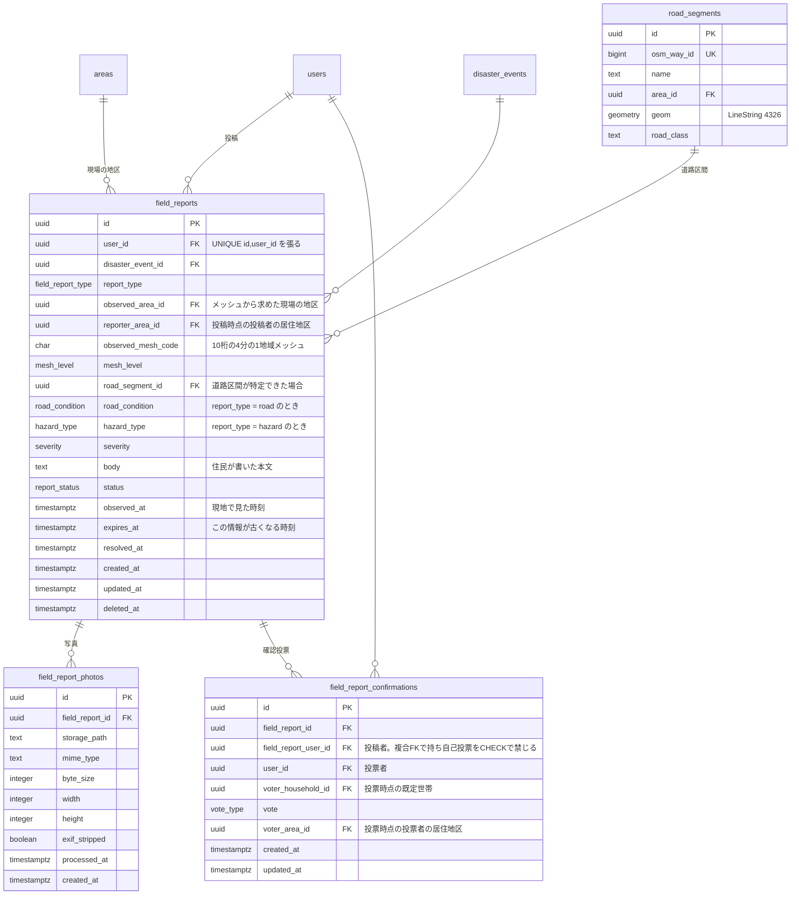

# 現地報告

| 対応機能 | 内容 | 優先度 |
| --- | --- | --- |
| C3 | 通行可否の共有（住民が通れた／通れない道を投稿する部分） | P1 |
| C4 | 危険箇所の登録・注意喚起 | P1 |
| E3 | 地区ラベルと信頼度表示 | P1 |
| S1 | 位置情報のメッシュ丸め | P1 |
| S2 | 写真の Exif 除去 | P1 |

住民が地図に上げる情報を**現地報告**（`field_reports`）と呼ぶ。
通行可否も危険箇所も店舗の営業状況も、位置と時刻と内容を持つという点で同じ形をしている。
一つのテーブルに `field_report_type` で種別を持たせ、種別固有の項目だけを NULL 可のカラムとして並べる。

テーブルを種別ごとに割らないのは、地図の表示が「この範囲の、この時間帯の、有効な報告を全部」という一つの問い合わせになるためである。
3 テーブルに割ると、地図を描くたびに UNION が要る。

## 二つの地区を区別する

現地報告には、性格の違う地区が二つ関わる。

- **現場の地区**（`observed_area_id`）。投稿された位置のメッシュから求める。地図上のピンが立つ場所であり、「どこの情報か」を表す。
- **投稿者の居住地区**（`reporter_area_id`）。投稿時点の `users.area_id` をコピーする。「誰が言っているか」を表す。

住民は自宅の外でも投稿する。通勤路の冠水、買い物先の道路の崩落は、居住地区の外で起きる。
一つの `area_id` だけを持つと、地図上のピンの場所と地区ラベルが食い違い、「〇〇町の情報」という表示が現場を指すのか投稿者の住所を指すのかが決まらない。

信頼度の表示（E3）はこの二つの関係で決まる。
現場の地区に住む人が確認したのか、地区外の通りすがりが確認したのかで、情報の重みが変わる。

## 設計の骨格

位置は緯度経度で保存しない。
投稿時にクライアントから受け取った座標をサーバ側で 250m メッシュのコードに変換し、コードと、そこから求めた `observed_area_id` だけを保存する（S1）。
座標をカラムに残したまま表示時に丸める方式にはしないのは、正確な座標が残ればログ、管理画面、権限設定の誤り、バックアップの持ち出しといった複数の経路から取り出せるためである。

写真は Storage に置き、DB にはパスと Exif 除去の完了フラグを持つ（S2）。
`exif_stripped` を NOT NULL DEFAULT false にし、true でない行は投稿者以外に見せない。
除去処理が落ちたときに、位置情報の付いた写真がそのまま公開される事故を防ぐ。

信頼度（E3）は投稿本文ではなく、他の住民の**確認投票**（`field_report_confirmations`）から計算する。
投票は独立した報告ではないため、表示の文言も「確認した人数」として書く。

## ER図



## テーブル定義

### field_reports（現地報告）

| カラム | 型 | 制約 | 説明 |
| --- | --- | --- | --- |
| `id` | `uuid` | PK。`(id, user_id)` にも UNIQUE | クライアントで採番してから送る |
| `user_id` | `uuid` | FK → `users.id` ON DELETE RESTRICT, NOT NULL | |
| `disaster_event_id` | `uuid` | FK | 平時の投稿なら NULL |
| `report_type` | `field_report_type` | NOT NULL | `road` / `hazard` / `shop` / `other` |
| `observed_area_id` | `uuid` | FK → `areas.id`, NOT NULL | `observed_mesh_code` から `areas.boundary` で求める |
| `reporter_area_id` | `uuid` | FK → `areas.id` | 投稿時点の `users.area_id` のコピー。未設定なら NULL |
| `observed_mesh_code` | `char(10)` | NOT NULL | 250m メッシュ。緯度経度は保存しない |
| `road_condition` | `road_condition` | | `report_type = road` のとき NOT NULL |
| `hazard_type` | `hazard_type` | | `report_type = hazard` のとき NOT NULL |
| `severity` | `severity` | NOT NULL DEFAULT `medium` | |
| `body` | `text` | CHECK 400 文字以内 | AI に渡すときはデータとして隔離する（S5） |
| `status` | `report_status` | NOT NULL DEFAULT `active` | |
| `observed_at` | `timestamptz` | NOT NULL, CHECK 未来でない | 投稿時刻とは別に持つ |
| `expires_at` | `timestamptz` | NOT NULL | 既定は `observed_at + 6 時間` |
| `deleted_at` | `timestamptz` | | 投稿者による取り消し |

`(id, user_id)` に UNIQUE を張るのは、`field_report_confirmations` から複合外部キーで投稿者を参照し、自己投票を CHECK 制約で禁じるためである。

`reporter_area_id` を `users.area_id` から都度辿らずコピーするのは、投稿者が引っ越した後に過去の投稿の表示が書き換わるのを防ぐためである。

`expires_at` を必須にするのは、災害時の情報が数時間で古くなるためである。
冠水は引き、通れなかった道が通れるようになる。
期限を過ぎた行はバッチで `status = 'expired'` にし、地図から落とす。行は消さない。ルート提案（C3）が参照した根拠として残す必要がある。

種別ごとの必須カラムは CHECK 制約で縛る。

```sql
alter table public.field_reports
  add constraint field_reports_type_check
  check (
    (report_type = 'road'   and road_condition is not null and hazard_type is null)
    or (report_type = 'hazard' and hazard_type is not null and road_condition is null)
    or (report_type in ('shop', 'other'))
  );
```

### road_segments（道路区間）

通行可否は本来「点」ではなく「区間」の情報である。
外部の道路データ（OpenStreetMap など）を取り込めた場合は `road_segment_id` を埋め、区間単位で表示する。
取り込めない場合は NULL のままメッシュ単位で扱う。

区間との対応づけは、投稿を受け取った時点の正確な座標から最寄りの区間を引いて行う（[05](05-route.md#座標の扱い)）。
メッシュに丸めた後では、250m 四方に複数の道路が入るため、どの区間かを特定できない。

このテーブルを任意項目にしておくのは、外部データの調達が 2 週間の中で確実とは言えないためである。
`road_segment_id` が埋まらなくても地図への重ね合わせは成立し、埋まれば表示とルート探索の粒度が上がる。

### field_report_photos（写真）

| カラム | 型 | 制約 | 説明 |
| --- | --- | --- | --- |
| `storage_path` | `text` | NOT NULL | Supabase Storage 上のパス |
| `exif_stripped` | `boolean` | NOT NULL DEFAULT false | 除去が済むまで false |
| `processed_at` | `timestamptz` | | 除去処理の完了時刻 |
| `byte_size` | `integer` | CHECK 10MB 以下 | |

アップロードの流れは、Storage の非公開バケットに置く、サーバ側で Exif を除去して同じパスに上書きする、`exif_stripped` を true にする、という順になる。
公開バケットに直接置かせない。除去前の画像に URL が振られてしまう。

RLS と Storage のポリシーの両方で、`exif_stripped = false` の写真を投稿者以外に見せない。

### field_report_confirmations（確認投票）

| カラム | 型 | 制約 | 説明 |
| --- | --- | --- | --- |
| `field_report_id` | `uuid` | FK, NOT NULL | |
| `field_report_user_id` | `uuid` | NOT NULL。`(field_report_id, field_report_user_id)` → `field_reports(id, user_id)` の複合 FK | 自己投票の禁止に使う |
| `user_id` | `uuid` | FK, NOT NULL。`(field_report_id, user_id)` に UNIQUE | 投票者 |
| `voter_household_id` | `uuid` | FK, NOT NULL。`(field_report_id, voter_household_id)` に UNIQUE | 投票時点の既定世帯 |
| `vote` | `vote_type` | NOT NULL | `confirm` / `deny` |
| `voter_area_id` | `uuid` | FK, NOT NULL | 投票時点の投票者の居住地区 |

```sql
alter table public.field_report_confirmations
  add constraint field_report_confirmations_no_self_vote
  check (user_id <> field_report_user_id);
```

一意制約を二つ張る。
`(field_report_id, user_id)` は同じ人の二重投票を防ぐ。
`(field_report_id, voter_household_id)` は世帯単位で 1 票にする。同居する家族が全員で確認を押しても票数は 1 になり、家庭内の人数の差が信頼度に効かなくなる。

投票の取り消しは行を消すのではなく `vote` を更新する形にし、UPSERT で受ける。

## 信頼度の計算と限界

表示するのは点数ではなく、**現場の地区に住む何人が確認したか**という数え上げにする。
スコアだけを出すと、その値がどう作られたかが利用者から見えず、誤情報対策として説明できない。

```sql
create view public.v_field_report_reliability as
select
  r.id                                       as field_report_id,
  r.observed_area_id,
  count(*) filter (
    where c.vote = 'confirm' and c.voter_area_id = r.observed_area_id
  )                                          as local_confirms,
  count(*) filter (
    where c.vote = 'confirm' and c.voter_area_id is distinct from r.observed_area_id
  )                                          as visitor_confirms,
  count(*) filter (
    where c.vote = 'deny' and c.voter_area_id = r.observed_area_id
  )                                          as local_denies,
  count(*) filter (
    where c.vote = 'deny' and c.voter_area_id is distinct from r.observed_area_id
  )                                          as visitor_denies,
  (r.reporter_area_id = r.observed_area_id)  as reporter_is_local
from public.field_reports r
left join public.field_report_confirmations c
  on c.field_report_id = r.id
 and c.created_at <= r.expires_at
group by r.id, r.observed_area_id, r.reporter_area_id;
```

画面には「〇〇町に住む 4 人が確認」「地区外から 1 人が確認」「違うという報告が 1 件」をそのまま並べる。
`reporter_is_local` は投稿者が現場の地区の住民かどうかを示す。地区外からの投稿を禁止せず、ラベルとして示すにとどめる。旅行者や配送員の報告が有用な場面はある。

集計対象を `created_at <= r.expires_at` に限るのは、期限切れの投稿に後から票を積んで信頼度を上げる操作を防ぐためである。

投票の資格は次のように絞る。

| 条件 | 実装 |
| --- | --- |
| 投稿者本人は投票できない | 複合 FK と CHECK 制約 |
| 同じ世帯からは 1 票まで | `(field_report_id, voter_household_id)` の UNIQUE |
| 電話確認を済ませたアカウントのみ | RLS の WITH CHECK で `users.verification_level = 'phone'` を要求 |
| 投票にもレート制限をかける | `rate_limit_action = 'confirmation'`（[07](07-safety-moderation.md#レート制限)） |
| 期限を過ぎた票は数えない | 上のビューの結合条件 |

これらを揃えても、票数だけで誤情報を止められるわけではない。
電話番号を複数用意すれば票は作れるし、同じ地区の住民が示し合わせれば地区内の票も積める。
票数は「その情報を裏づける人がどれだけいるか」を示す材料であって、真偽の判定ではない。
表示も「確認した人数」にとどめ、「正しい情報」と読める文言にはしない。
最終的な誤情報への対処は通報とモデレーション（[07](07-safety-moderation.md)）が担う。

投票者が実際に現場付近にいたかを条件に加える案は、今回は採らない。
位置の継続的な取得が要り、S1 で位置を丸める方針と噛み合わないためである。
居住地区の一致をラベルとして出すところまでにとどめる。

近接する報告をまとめる集約は、同じ `observed_mesh_code` と同じ `report_type` の `active` な報告をグループにする形で行う。
クラスタリングを持ち込まないのは、メッシュがすでに空間の分割になっているためである。

## 認可

| 操作 | ポリシー |
| --- | --- |
| SELECT | `status <> 'hidden'` かつ `deleted_at is null` の行は全ユーザ。自分の投稿は状態にかかわらず見える |
| INSERT | `auth.uid() = user_id`。加えて `verification_level <> 'anonymous'` とレート制限を通す（S3） |
| UPDATE | 投稿者本人のみ。`status`、`observed_area_id`、`reporter_area_id`、`user_id` は変更させない |
| DELETE | 物理削除は許さない。`deleted_at` の更新だけを許す |

`status` を投稿者に更新させないのは、運営が `hidden` にした投稿を本人が `active` に戻せてしまうためである。
解消報告は `resolved_at` の更新として受け、`status` はトリガで反映する。

変更させないカラムは、`UPDATE` の `WITH CHECK` だけでは表現しにくい。
更新前後の値を比較する BEFORE UPDATE トリガで、対象カラムを旧値に戻す。

## インデックス

| テーブル | インデックス | 用途 |
| --- | --- | --- |
| `field_reports` | `(observed_area_id, status, observed_at DESC)` | 地区の地図表示 |
| `field_reports` | `(observed_mesh_code text_pattern_ops)` | メッシュの前方一致で広域から絞る |
| `field_reports` | `(disaster_event_id, report_type, status)` | 種別ごとの一覧 |
| `field_reports` | `(user_id, created_at DESC)` | 投稿者の一覧、通報時の投稿履歴の確認 |
| `field_reports` | UNIQUE `(id, user_id)` | 確認投票からの複合 FK |
| `field_reports` | 部分 `(expires_at) where status = 'active'` | 期限切れバッチ |
| `field_report_confirmations` | UNIQUE `(field_report_id, user_id)` | 二重投票の防止 |
| `field_report_confirmations` | UNIQUE `(field_report_id, voter_household_id)` | 世帯 1 票 |
| `field_report_photos` | `(field_report_id)` | 写真の取得 |
| `road_segments` | GiST `(geom)` | 座標から区間を引く |

レート制限の判定は `field_reports` を数える方式ではなく専用のカウンタで行う（[07](07-safety-moderation.md#レート制限)）。
論理削除された投稿が数から外れ、投稿と削除を繰り返す抜け道ができるためである。
