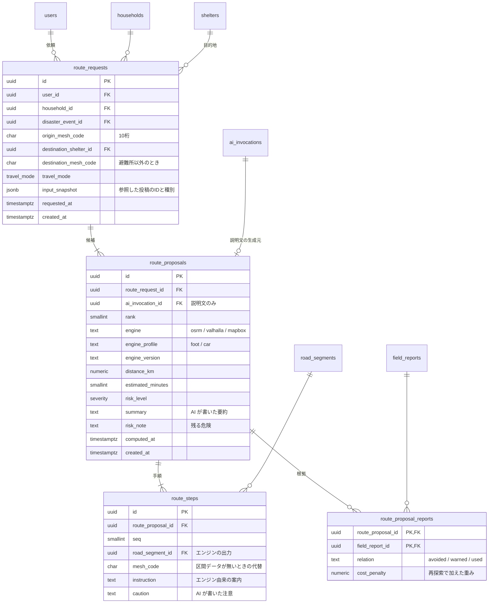
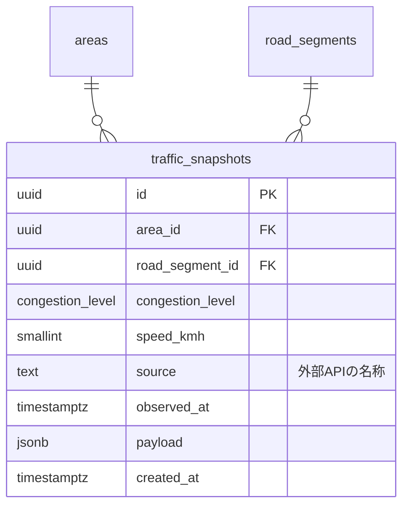

# ルート提案と交通

| 対応機能 | 内容 | 優先度 |
| --- | --- | --- |
| C3 | 通行可否を踏まえた経路の提示 | P1 は地図への重ね合わせまで、動的な再探索は P2 |
| C1 | リアルタイム道路混雑状況 | P2 |

住民の現地報告（[04-field-report.md](04-field-report.md)）を入力に、避難先までの経路を提示する部分をここに置く。
投稿と提案を別ファイルに分けたのは、両者の更新頻度と作り手が違うためである。
投稿は住民が作り、提案はサーバが作る。

## 経路を誰が作るか

経路そのものは探索エンジンが作り、AI は作らない。

250m メッシュの列だけでは、道路が実際につながっているか、橋が架かっているか、一方通行か、歩道や階段があるかを判定できない。
言語モデルにメッシュの列を出させると、存在しない接続や渡れない川を含む経路が混ざる。
避難の場面でそれを出すのは、遠回りを提示するより悪い。

責務は次のように分ける。

| 工程 | 担当 | 出力 |
| --- | --- | --- |
| 1. 経路候補の計算 | 探索エンジン（OSRM、Valhalla、Mapbox のいずれか） | 道路区間の列、距離、所要時間 |
| 2. 現地報告の道路区間への対応づけ | サーバ（PostGIS） | 通行不可・注意の区間の集合 |
| 3. 危険区間の除外またはコスト加算と再探索 | サーバ + 探索エンジン | 迂回した候補 |
| 4. 候補の説明、注意点、代替案の要約 | AI | 文章のみ |

AI が触るのは `route_proposals.summary` と `route_steps.caution` に入る文章だけで、`route_steps` の並びと `road_segment_id` には触らない。
AI に渡す選択肢も、工程 3 で得た候補の ID に限る。自由に経路を書かせない。

エンジンの選定はまだ決めていない（[ER-Diagram.md の未決の項目](../ER-Diagram.md#未決の項目)）。
自前で OSRM を立てるか外部 API を使うかで、`route_proposals.engine` に入る値と運用の手間が変わる。

## 座標の扱い

工程 1 から 3 は、道路網との対応づけに数 m の精度を要求する。
メッシュに丸めた座標では計算できない。

そこで、精度と保存を分ける。

- リクエストの処理中は、クライアントから受け取った正確な座標をメモリ上で使う。
- DB に保存するのは、出発点と目的地の丸めたメッシュコードと、経路を構成する道路区間の ID に限る。
- 道路区間は公共のインフラであり個人情報ではないので、そのまま保存してよい。

出発点の周辺だけはメッシュに丸めた分だけ経路がぼやける。
画面では最初の区間を「自宅付近から」と表示し、正確な出発点は描かない。

## ER図



交通状況は経路とは独立に取り込む。



## テーブル定義

### route_requests（ルート依頼）

一回の依頼が 1 行になる。
`input_snapshot` には、そのとき参照した現地報告の ID、種別、対応づけた区間を JSONB で残す。
投稿は数時間で `expired` になるため、外部キーだけでは提案の再現ができない。

出発点は `origin_mesh_code` で、既定値は `households.home_mesh_code` になる。
避難の途中で経路を引き直す場合は、そのときの現在地を丸めた値が入る。

目的地は避難所（`destination_shelter_id`）か、それ以外のメッシュ（`destination_mesh_code`）のどちらかで、両方 NULL にはできない。

```sql
alter table public.route_requests
  add constraint route_requests_destination_check
  check (
    (destination_shelter_id is not null) <> (destination_mesh_code is not null)
  );
```

### route_proposals（経路候補）

`rank` が 1 の候補を既定で表示し、残りを「別の道」として並べる。
`engine`、`engine_profile`、`engine_version` を残すのは、同じ依頼で経路が変わったときに、原因が投稿の増減なのかエンジンの更新なのかを切り分けるためである。

`risk_level` と `risk_note` を必ず持たせるのは、どの経路にも残る危険があり、「安全な道」と言い切れないためである。
危険が報告されていない場合も `risk_note` に「大きな危険は報告されていない」と入れ、空欄にしない。

`summary` は AI が書く。`ai_invocation_id` から、どの呼び出しで生成されたかを辿れるようにする。

### route_steps（手順）

`(route_proposal_id, seq)` に UNIQUE を張る。

カラムの由来を分ける。

| カラム | 由来 | 検証 |
| --- | --- | --- |
| `seq` / `road_segment_id` / `instruction` | 探索エンジン | エンジンの出力をそのまま入れる |
| `mesh_code` | サーバ | 区間データが無い場合の代替。区間の中点から求める |
| `caution` | AI | 根拠となる投稿を `route_proposal_reports` に持つことを条件に保存する |

`road_segment_id` と `mesh_code` は少なくとも一方が埋まる。

```sql
alter table public.route_steps
  add constraint route_steps_location_check
  check (road_segment_id is not null or mesh_code is not null);
```

### route_proposal_reports（提案の根拠）

`relation` が `avoided` なら「この投稿があったのでこの区間を避けた」、`warned` なら「通るが注意が要る」、`used` なら「通れたという報告があったのでこの区間を通した」を意味する。
`cost_penalty` には再探索で加えた重みを入れ、なぜ遠回りになったかを数値でも辿れるようにする。
複合主キーは `(route_proposal_id, field_report_id)` にする。

この行があることで、画面は「〇〇町に住む3人が通行不可と確認した××通りを避けています」という説明を出せる。
表示に必要な確認人数は `v_field_report_reliability` から引く。

投稿を区間に対応づけるビューを用意し、工程 2 と 3 の入力にする。

```sql
create view public.v_blocked_segments as
select
  fr.id                as field_report_id,
  seg.id               as road_segment_id,
  fr.road_condition,
  fr.severity,
  fr.expires_at
from public.field_reports fr
join public.road_segments seg
  on seg.id = fr.road_segment_id
  or (
    fr.road_segment_id is null
    and st_dwithin(
      seg.geom::geography,
      public.mesh_to_center(fr.observed_mesh_code),
      180
    )
  )
where fr.status = 'active'
  and fr.report_type = 'road'
  and fr.road_condition in ('caution', 'impassable');
```

`road_segment_id` が埋まっていない投稿は、メッシュ中心から 180m 以内の区間すべてに広げる。
250m メッシュの中心から角までが約 177m なので、この距離なら区画内の区間を漏らさず拾える。
そのぶん隣の道まで巻き込むため、こうして拾った区間は `avoided` ではなく `warned` として扱い、除外せずコストを上げるだけにする。

### traffic_snapshots（交通状況）

外部 API から取得した混雑状況を時系列で溜める。
`area_id` と `road_segment_id` はどちらか一方が埋まればよい。
供給元によって粒度が違い、区間単位で取れる API もあれば地域単位のものもある。

このテーブルは P2 であり、データの調達可否を調べてから作る。
取得できない場合はテーブルごと作らず、経路の重みは現地報告だけから決める。
交通状況を必須の入力にしないことで、調達が失敗しても工程 1 から 4 は成立する。

古いスナップショットは 7 日で削除する。時系列の分析は今回の対象ではない。

## 認可

| テーブル | SELECT | INSERT |
| --- | --- | --- |
| `route_requests` / `route_proposals` / `route_steps` | 同じ世帯のメンバー | service role のみ |
| `route_proposal_reports` | 同じ世帯のメンバー | service role のみ |
| `road_segments` / `traffic_snapshots` | 全ユーザ | service role のみ |

service role で書き込むとき、`household_id` はリクエストの値ではなく `auth.uid()` から解決する（[00](00-conventions.md#db-クライアントの使い分け)）。

経路を他人に見せないのは、出発点が自宅のメッシュであり、経路の集合から住まいが絞れるためである。

## インデックス

| テーブル | インデックス | 用途 |
| --- | --- | --- |
| `route_requests` | `(household_id, requested_at DESC)` | 直近の依頼 |
| `route_proposals` | `(route_request_id, rank)` | 候補の並び |
| `route_steps` | UNIQUE `(route_proposal_id, seq)` | 手順の順序 |
| `route_steps` | `(road_segment_id)` | 区間から経路の逆引き |
| `route_proposal_reports` | `(field_report_id)` | 「この投稿を根拠にした提案」の逆引き |
| `traffic_snapshots` | `(road_segment_id, observed_at DESC)` | 最新の混雑状況 |
| `traffic_snapshots` | `(observed_at)` | 古いデータの削除 |

## P1 で作る範囲

2 週間の中では、工程 1 から 4 のうち動的な再探索まで作り切るのは難しい。
P1 では次までを対象にし、残りを P2 に送る。

| 範囲 | スコープ |
| --- | --- |
| 現地報告を地図に重ね、危険区間を色分けして表示する | P1 |
| 事前設定した避難ルート（A5）の上に危険区間を重ねる | P1 |
| 探索エンジンによる経路計算と、危険区間を避けた再探索 | P2 |
| AI による説明文の生成 | P2 |

`route_requests` 以下のテーブルは P2 で作る。
P1 の段階で必要なのは `road_segments` と `v_blocked_segments` までである。
