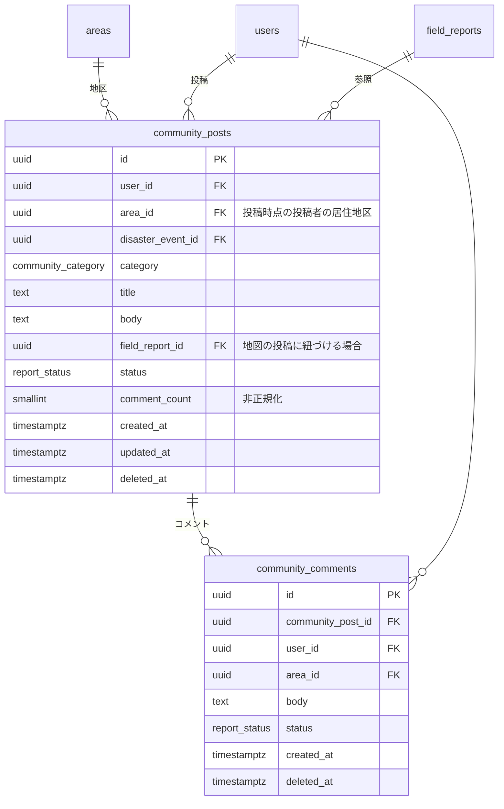
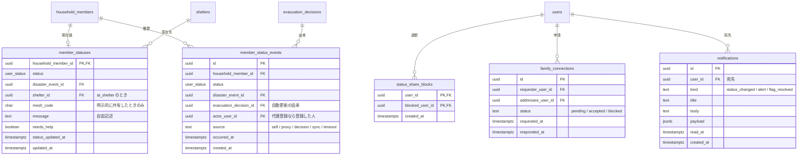

# コミュニティと安否

| 対応機能 | 内容 | 優先度 |
| --- | --- | --- |
| E1 | 地域のコミュニティ（周辺店舗の営業状況を含む） | P2 |
| E4 | ステータス表示（避難済み／支援が必要など） | P2 |
| E5 | 家族への状況共有 | P2 |

いずれも P2 であり、P1 が終わってから着手する。
ただし E1 は誤情報対策（E3）とセットでなければ成立しないため、地区ラベルと通報の導線（[07-safety-moderation.md](07-safety-moderation.md)）を先に用意する。

## 設計の骨格

地図にピンを立てる情報は現地報告（`field_reports`）に、立てない会話は `community_posts` に分ける。
店舗の営業状況（E2 相当）は場所と結びつくので現地報告の `report_type = 'shop'` として扱い、コミュニティ側には持たない。
同じ情報を二つのテーブルに置くと、通報と削除の導線（S4）を二重に作ることになる。

安否のステータス（E4）は、`evacuation_decisions` から自動で決まる部分と、手で設定する部分の両方がある。
現在値を `member_statuses` に 1 構成員 1 行で持ち、変化を `member_status_events` に追記する。
現在値を履歴から毎回導出しない。災害時に最も引かれるのが現在値であり、そこを集計にすると遅い。

家族への共有（E5）は、同じ世帯のメンバー（`household_members`）を既定の共有先とする。
別世帯の家族（実家の親など）には `family_connections` で相互承認の関係を張る。

## 安否の主体

安否の主体を、ユーザではなく**世帯構成員**（`household_members`）にする。

災害時に安否を知りたい相手は、スマホを持たない高齢の親や子どもであることが多い。
主体をユーザにすると、アカウントを持たない家族（[01](01-account-household.md#アカウントを持たない家族)）は安否を持てず、E4 と E5 はアプリを使っている本人の分しか扱えない。
世帯の全員が画面に並び、家族が代理で登録できる形にする。

この形には、一人のユーザが複数の世帯に属する場合に安否が世帯ごとに分かれるという弱点がある。
実家と自宅の両方に登録している人は、`household_members` の行を 2 つ持つためである。
これはトリガで揃える。

```sql
-- アカウントを持つ構成員の安否が変わったら、同じユーザの他の世帯にも反映する
create function public.sync_member_status()
returns trigger
language plpgsql
security definer
set search_path = public
as $$
declare
  v_user_id uuid;
begin
  if pg_trigger_depth() > 1 then
    return new;
  end if;

  select user_id into v_user_id
  from public.household_members
  where id = new.household_member_id;

  if v_user_id is null then
    return new;
  end if;

  update public.member_statuses ms
  set status            = new.status,
      shelter_id        = new.shelter_id,
      mesh_code         = new.mesh_code,
      message           = new.message,
      needs_help        = new.needs_help,
      status_updated_at = new.status_updated_at
  from public.household_members hm
  where hm.id = ms.household_member_id
    and hm.user_id = v_user_id
    and ms.household_member_id <> new.household_member_id;

  return new;
end;
$$;
```

`pg_trigger_depth()` で再帰を止める。
更新の起点になった行と同じ値を配るだけなので、1 段目で全員が揃う。

誰が更新できるかは、対象がアカウントを持つかどうかで分ける。

| 対象 | 更新できる人 |
| --- | --- |
| アカウントを持つ構成員 | 本人のみ |
| アカウントを持たない構成員 | 同じ世帯のメンバー（代理登録） |

アカウントを持つ人の安否を家族が書き換えられないようにする。
本人が「無事」と書いたものを別の人が「不明」に戻せると、安否の意味が失われる。

## 安否の共有範囲

「同じ世帯なら自動で共有」を無条件の規則にはしない。
同居していても居場所を知られたくない相手はいる。DV や交際相手からの追跡が絡む場合、世帯の所属をもって共有先とみなす設計は加害の道具になりうる。
世帯からの離脱が手続き上すぐに反映されない場面もある。

共有の可否は三つの仕組みで決まる。

| 仕組み | カラム / テーブル | 適用先 | 役割 |
| --- | --- | --- | --- |
| 既定の範囲 | `users.status_share_scope` | アカウントを持つ構成員 | `household`（同居の家族まで）／ `family`（別世帯の家族も）／ `none`（誰にも見せない） |
| 代理登録の範囲 | `household_members.proxy_share_scope` | アカウントを持たない構成員 | 既定は `household`。世帯の管理者が `family` に上げられる |
| 相手ごとの遮断 | `status_share_blocks` | アカウントを持つ構成員 | 範囲の内側であっても、この相手には見せない |

アカウントを持たない構成員の共有範囲を、本人ではなく世帯が決めることになる。
本人が同意を示せない以上、既定は世帯の内側に閉じる。
別居する娘に実家の父の安否を見せたい場合のように、外へ出す必要があるときだけ管理者が明示的に `family` へ上げる。

遮断は相手に通知しない。
遮断されたことが分かると、直接尋ねる圧力になるためである。
遮断された側の画面では、その人が共有範囲に入っていないことと、共有していないことの区別を付けない。

`member_statuses.mesh_code`（現在地）は既定で保存しない。
現在地の共有を明示的に選んだときにだけ埋める。

## ER図：コミュニティ



## ER図：安否と共有



## テーブル定義

### community_posts / community_comments

現地報告と同じく `area_id` を投稿時点の値としてコピーする。
コミュニティ投稿には位置が無いため、ここでの `area_id` は投稿者の居住地区を指す。現地報告のような現場の地区とは別物になる。

`status` は `report_status` を流用し、運営が `hidden` にできるようにする（S4）。

`comment_count` を非正規化して持つのは、一覧画面でコメント数を出すために毎回サブクエリを回すのを避けるためである。
コメントの挿入と論理削除のトリガで増減させる。

投稿者名の表示は `user_public_profiles` から引く（[07](07-safety-moderation.md#user_public_profiles)）。
`users` を直接読ませない。

投稿は地区に閉じる。RLS で「自分の地区、またはその親の市区町村に属する地区」の投稿だけを見せる。
全国の投稿が混ざると、E3 の地区ラベルが意味を失う。

コミュニティに参加できるのはアカウントを持つ人だけなので、こちらの主体は `users` のままでよい。

### member_statuses（現在の安否）

| カラム | 型 | 制約 | 説明 |
| --- | --- | --- | --- |
| `household_member_id` | `uuid` | PK, FK → `household_members.id` ON DELETE CASCADE | 1 構成員 1 行 |
| `status` | `user_status` | NOT NULL DEFAULT `unknown` | |
| `shelter_id` | `uuid` | FK | `status = at_shelter` のとき NOT NULL |
| `mesh_code` | `char(10)` | | 現在地の共有を選んだときのみ |
| `needs_help` | `boolean` | NOT NULL DEFAULT false | `status` と別に立てる |
| `status_updated_at` | `timestamptz` | NOT NULL | 最後に状態が変わった時刻 |

`needs_help` を `status` の値の一つにせず独立させるのは、「避難所にいるが支援が必要」という状態があるためである。
`status` の列挙に押し込むと、値の組み合わせが増えて画面の分岐が複雑になる。

`status_updated_at` が古い行は「〇時間前の情報」と添えて表示する。
更新が止まっている状態と、無事だと分かっている状態を、画面で同じに見せないための表示になる。
代理で登録された行はこの表示がとくに効く。本人が更新しているわけではないため、時刻が古いまま残りやすい。

世帯に構成員を追加したら `member_statuses` の行をトリガで作る。
行が無い状態と `unknown` の状態を区別する必要が無く、画面の分岐が減る。

### member_status_events（安否の履歴）

`evacuation_decisions.status` が変わったときにトリガで 1 行追加し、同時に `member_statuses` を更新する。

`source` で更新の出どころを区別する。

| `source` | 意味 |
| --- | --- |
| `self` | 本人が手で更新した |
| `proxy` | 家族が代理で更新した。`actor_user_id` に登録した人が入る |
| `decision` | `evacuation_decisions` の変化から自動で更新した |
| `sync` | 同じユーザの別の世帯の行から同期した |
| `timeout` | 一定時間の更新が無く `unknown` に戻した |

手動の更新（`self`、`proxy`）を自動更新で上書きしないよう、手動の値のほうが新しい場合は `decision` による更新を無視する。

### status_share_blocks（相手ごとの遮断）

`(user_id, blocked_user_id)` の複合主キーで、`user_id` が `blocked_user_id` に自分の安否を見せないことを表す。
この行の存在自体を相手に見せない。SELECT のポリシーは `user_id = auth.uid()` に限る。

遮断はアカウントを持つ人が自分の安否について設定するものになる。
代理登録された構成員の安否は `proxy_share_scope` で範囲そのものを絞る。

### family_connections（別世帯の家族）

相互承認の関係で、`(requester_user_id, addressee_user_id)` に UNIQUE を張る。
逆向きの重複を防ぐために UUID の大小で正規化する方式は採らず、申請の向きをそのまま残す。
誰が申請したかは、後からブロックの妥当性を判断するときに要る。
承認済みの判定は双方向で行うビューを用意する。

### notifications（通知）

家族の安否が変わったとき、地区に警戒情報が出たとき、通報が処理されたときに 1 行作る。
`payload` に画面遷移先の情報を JSONB で持つ。
Web Push の配信そのものはこのテーブルの範囲外で、送信済みかどうかは持たない。未読管理だけを担う。

既読から 30 日で削除する（[00](00-conventions.md#保持期間)）。

## 認可

| テーブル | SELECT | INSERT / UPDATE |
| --- | --- | --- |
| `community_posts` / `community_comments` | 同じ市区町村の地区に属するユーザ。`status <> 'hidden'` かつ `deleted_at is null` | 本人のみ |
| `member_statuses` | `can_view_member_status()` | `can_update_member_status()` |
| `member_status_events` | `can_view_member_status()` | トリガと service role |
| `status_share_blocks` | 本人のみ | 本人のみ |
| `family_connections` | 当事者の 2 人 | 申請は requester、承認は addressee |
| `notifications` | `user_id = auth.uid()` | service role のみ |

判定は関数にまとめ、ポリシーはそれを呼ぶだけにする。

```sql
-- 閲覧できるか
create function public.can_view_member_status(target_member uuid)
returns boolean
language sql
security definer
stable
set search_path = public
as $$
  with m as (
    select hm.id, hm.household_id, hm.user_id, hm.proxy_share_scope
    from public.household_members hm
    where hm.id = target_member
  )
  select
    -- 本人
    exists (select 1 from m where m.user_id = auth.uid())
    -- アカウントを持つ構成員
    or exists (
      select 1
      from m
      join public.users u on u.id = m.user_id
      where not exists (
              select 1 from public.status_share_blocks b
              where b.user_id = m.user_id and b.blocked_user_id = auth.uid()
            )
        and (
          (u.status_share_scope in ('household', 'family')
           and public.is_household_member(m.household_id))
          or (u.status_share_scope = 'family'
              and public.is_family_connected(m.user_id, auth.uid()))
        )
    )
    -- アカウントを持たない構成員
    or exists (
      select 1
      from m
      where m.user_id is null
        and (
          public.is_household_member(m.household_id)
          or (
            m.proxy_share_scope = 'family'
            and exists (
              select 1
              from public.household_members hm2
              where hm2.household_id = m.household_id
                and hm2.user_id is not null
                and public.is_family_connected(hm2.user_id, auth.uid())
            )
          )
        )
    );
$$;

-- 更新できるか
create function public.can_update_member_status(target_member uuid)
returns boolean
language sql
security definer
stable
set search_path = public
as $$
  select exists (
    select 1
    from public.household_members hm
    where hm.id = target_member
      and (
        hm.user_id = auth.uid()
        or (hm.user_id is null and public.is_household_member(hm.household_id))
      )
  );
$$;
```

`is_family_connected(a, b)` は `family_connections` の承認済みの関係を双方向で判定する関数になる。

アカウントを持たない構成員を `family` まで広げた場合、その世帯のアカウント保有者とつながっている相手に見える。
世帯の誰か一人とつながれば全員の安否が見えることになるため、この設定は画面で明示的に選ばせる。

通知の作成は service role で行うため、宛先の解決にも `can_view_member_status()` を通す。
共有範囲の外にいる相手へ通知を送ると、テーブルの RLS を通らない経路で安否が漏れる。

## インデックス

| テーブル | インデックス | 用途 |
| --- | --- | --- |
| `community_posts` | `(area_id, status, created_at DESC)` | 地区のタイムライン |
| `community_comments` | `(community_post_id, created_at)` | コメントの並び |
| `member_statuses` | `(status_updated_at)` | 更新が止まった行の検出 |
| `member_status_events` | `(household_member_id, occurred_at DESC)` | 履歴の表示 |
| `status_share_blocks` | `(blocked_user_id)` | 判定時の逆引き |
| `family_connections` | UNIQUE `(requester_user_id, addressee_user_id)` | 重複申請の防止 |
| `family_connections` | `(addressee_user_id, status)` | 承認待ちの一覧 |
| `notifications` | 部分 `(user_id, created_at DESC) where read_at is null` | 未読の取得 |

`member_statuses` は世帯の展開で必ず `household_members` と結合して引くため、主キー以外の結合用インデックスは要らない。
